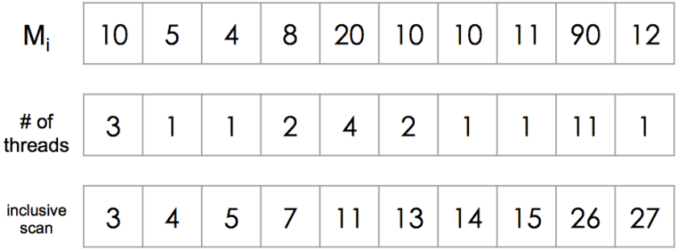
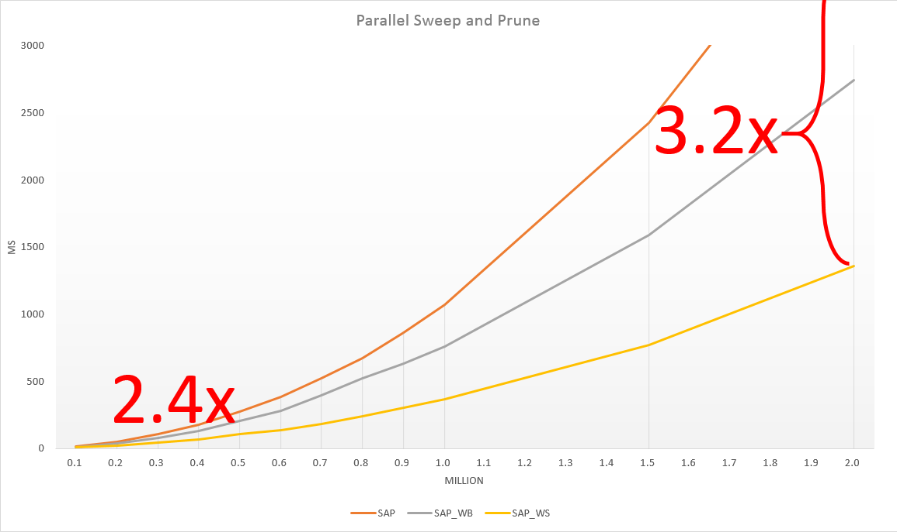

# Real-time Collision Culling of a Million Spheres on GPU
## Introduction
-------------------
This is a final project from a course, GPGPU.  We implement a paper of collision detection based on GPU device.
You can see the original website of the paper at Reference.
In this project, we implement the parallel SaP algorithm, and some optimizations which were proposed in the paper.
Moreover, we propose two optimizations focus on <strong>global memory access</strong> by our own.
After all, we can detect collision between the number of 250K spheres in the <strong>real-time</strong>.
And we have 3.2x improvement in the number of 1M spheres.

## Algotithm

### Sweep and Prune
-------------------

- CPU version
	- Sorting by axis
	- Sweep window
	- Collision detection
- Worst case: O(n2)

### Parallel Sweep and Prune
-------------------

- GPU version
	- Sorting by axis
	- <strong>Sweep an object per thread</strong>
	- Collision detection
- Worse case: O(n2/p)
- Problem
	- Many false positive collided pair
	- Workload imbalance

## Optimization 1 - by Paper

### Choosing the Sweep Direction
-------------------

- Variance for x, y, z axis
	- thrust library: transform reduction
- Max variance axis
	- Sweep
- Other axis
	- Prune
- Complexity: O(n)
- Solved problem
	- Reduce false positive collided pair

### Workload Balancing
-------------------

- Make each thread having balanced workload.

-------------------

- Workload estimation
	- Binary search for Mi
- Workload balance
	- Get required # of threads per object
	- thrust library: inclusive scan (prefix sum)
- Parallel SaP
	- Binary search for object index
	- SaP
- Solved problem
	- Make workload balance

### Workspace Subdivision
-------------------

- Use prined axis
- Divide to groups
	- Groups for not crossing the line, Ci
	- Groups for crossing the line, Cri
- Duplicate the objects which touch the Cri

-------------------

- Choose group per object
- For group Ci
	- Mark
	- thrust library: inclusive scan (prefix sum)
	- Put into workspace
- For group Cri
	- Extension mark
	- Then same as group Ci
- Problem
	- Twice <strong>global memory access</strong>

## Optimation 2 - by Us

### Less Workspace Duplication
-------------------

- Choose group per object
- For group Cri
	- Extension mark
	- thrust library: inclusive scan (prefix sum)
	- Put into workspace
	- Workload balance and Parallel SaP
- For group Ci
	- thrust library: stable sort by group index
	- Workload balance and Parallel SaP
- Solved problem
	- <strong>25% less global memory access</strong>

### Less Global Memory Access
-------------------

- For group Cri
	- Duplicate information to workspace pointer.
	- Write bake to the object if collision occur.
- Solved problem
	- <strong>Reduce global memory access</strong>

## Expetiment Result

### Verify Correctness
-------------------

- All have the same z position
- Green means no collision.
- Red means collision occuring.

### Real-time Collision Detection of 0.25M Spheres
-------------------

- Useless comparation because of hardward improvement.

-------------------
- Comparation between our optimazations.

|Without Opt.|With Opt.|
|:--------:|:------:|
|||

### Performance of detection lantency
-------------------

### Performance of realtime FPS
-------------------
|Number of spheres| 100K | 200K | 300K |
|:---------------:|:---:|:------:|:------:|
| SAP    | 64 FPS | 20 FPS | 10 FPS |
| SAP_WB | 103 FPS | 29 FPS | 13 FPS |
| SAP_WS | 117 FPS | 48 FPS | 23 FPS |

## Reference
[Real-time Collision Culling of a Million Bodies on Graphics Processing Units](http://graphics.ewha.ac.kr/gSaP/)
